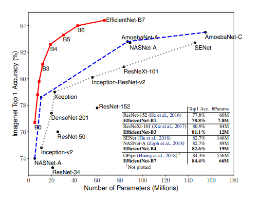
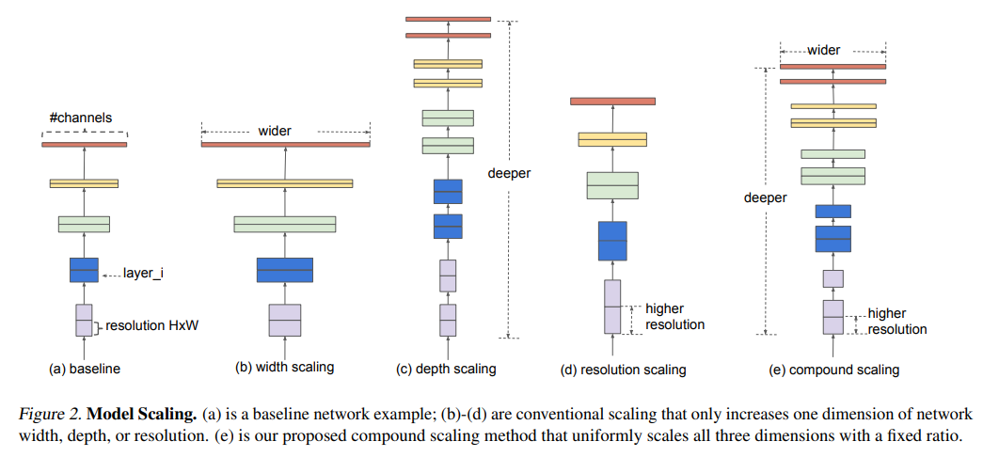
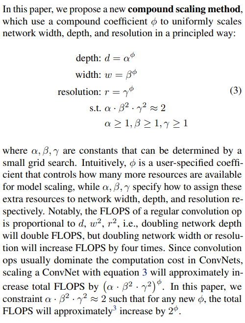
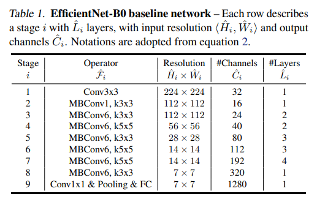
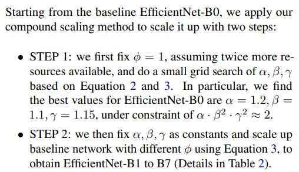

## 论文信息
* 论文名：EfficientNet: Rethinking Model Scaling for Convolutional Neural Networks
* 作者：Mingxing Tan, Quoc V. Le(1Google Research, Brain Team)
* [github link](https://github.com/lukemelas/EfficientNet-PyTorch)
* [arvix link](https://arxiv.org/pdf/1905.11946.pdf)

## 主要贡献（数据，模型，loss）
- 提出了新的主干网络，在文中的对比试验中，SOTA（但是用了AutoAugment，不客观，后面单独来说）


## 文章细节(他山之石)

- 网络的深度、宽度、尺度都会对结果有影响，因此文章建模如下，其中考虑到FLOPS，限制 $\alpha$ * $\beta$^2 * $\gamma$^2 $\approx$2 ；

- 文章采用搜索的方式进行上述参数学习，其中基础网络如下；

- 先固定搜索系数$\phi$，用小的grid search（真的小吗？）搜索出$\alpha $\beta $\gamma，再固定$\alpha $\beta $\gamma搜索出不同的组合系数$\phi 得到EfficientNet-B1/B7；

- 最后的参数如下：
```python
params_dict = {
    # Coefficients:   width,depth,res,dropout
    'efficientnet-b0': (1.0, 1.0, 224, 0.2),
    'efficientnet-b1': (1.0, 1.1, 240, 0.2),
    'efficientnet-b2': (1.1, 1.2, 260, 0.3),
    'efficientnet-b3': (1.2, 1.4, 300, 0.3),
    'efficientnet-b4': (1.4, 1.8, 380, 0.4),
    'efficientnet-b5': (1.6, 2.2, 456, 0.4),
    'efficientnet-b6': (1.8, 2.6, 528, 0.5),
    'efficientnet-b7': (2.0, 3.1, 600, 0.5),
}
```

## 借鉴点(可以攻玉)
- 主干网络可以用EfficientNet试下，直接上B7。